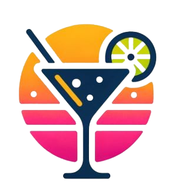

# Cocktail App

<p align="center">
  
</p>


A simple Vue.js application that displays 3 random cocktails fetched from TheCocktailDB API. The cocktails are refreshed each time the page is accessed or refreshed.

## Table of Contents

- [Features](#features)
- [Installation](#installation)
- [Docker Setup](#docker-setup)
- [Technologies Used](#technologies-used)

## Features

- Displays 3 random cocktails on page load.
- Fetches cocktail data from TheCocktailDB API.
- Responsive and user-friendly design.
- Expandable cocktail details with ingredients, instructions, and images.

## Installation

1. Clone the repository:

    ```sh
    git clone https://github.com/KhalilMohamed01/cocktail-app.git
    cd cocktail-app
    ```

2. Install dependencies:

      ```sh
      npm install
      ```

## Running the Application

To run the application locally, use the following command:

```sh
npm run dev
 ```

## Docker Setup
To build and run the application using Docker, follow these steps:

Build the Docker image:

```sh
docker build -t cocktail-app .
```

Run the Docker container:

```sh
docker run -p 8080:8080 cocktail-app
```

## Technologies Used
- Vue.js
- Vite
- Tailwind CSS
- Axios
- FontAwesome
- Docker
- **[TheCocktailDB API](https://www.thecocktaildb.com/)**
